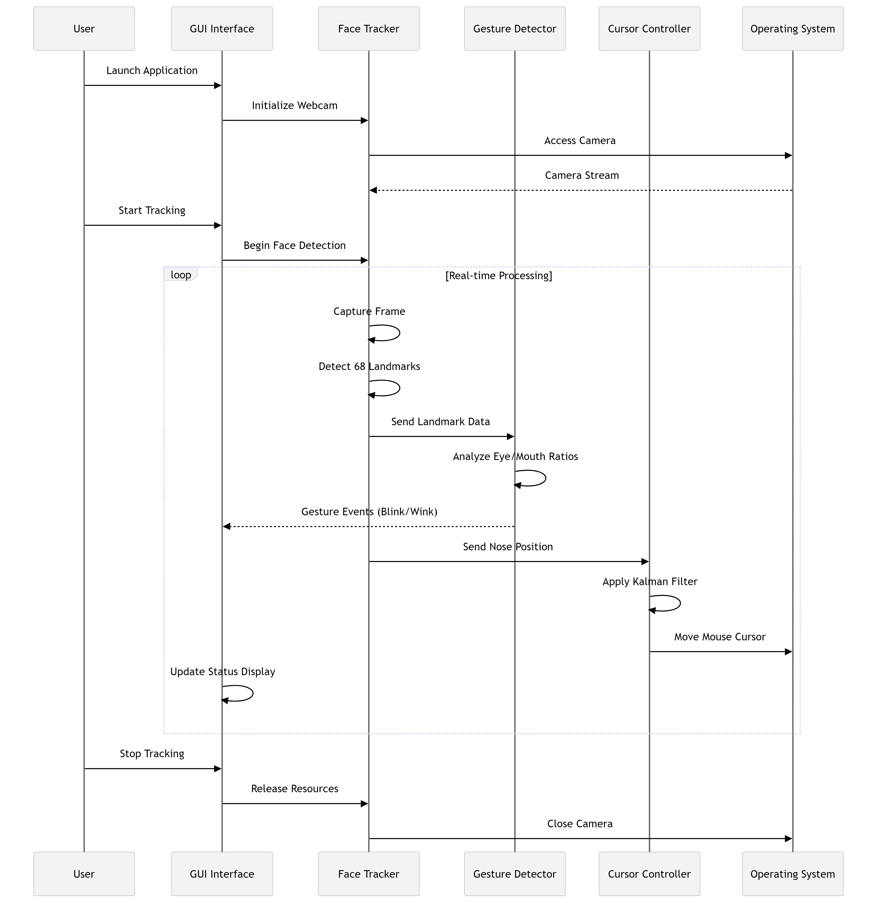

# Smart Cursor System 2.0

> **Next-generation facial tracking cursor control system with AI-powered gesture recognition**

Smart Cursor System 2.0 is a revolutionary accessibility tool that enables hands-free computer control through facial movements and gestures. Using advanced computer vision and machine learning algorithms, it transforms your webcam into a precise cursor control interface, making computing accessible for users with mobility limitations or providing an innovative input method for professionals.

## 🚀 Key Features

- **🎯 Precision Facial Tracking** - 68-point facial landmark detection with sub-pixel accuracy
- **🎮 Gesture Recognition** - Blink, wink, and mouth movement detection for click actions
- **⚡ Real-time Performance** - Optimized processing pipeline with &lt;15% CPU usage
- **🔧 Kalman Filter Smoothing** - Advanced mathematical filtering for stable cursor movement
- **🎛️ Configurable Sensitivity** - Adjustable movement speed (0.5x to 3x multiplier)
- **💻 Cross-Platform GUI** - Intuitive Tkinter interface with real-time status monitoring
- **📦 Portable Executable** - Single-file Windows .exe deployment
- **🛡️ Error Resilience** - Graceful handling of webcam failures and edge cases



## 📋 System Requirements

- **Operating System**: Windows 10/11, macOS 10.14+, Linux Ubuntu 18.04+
- **Python**: 3.8 or higher
- **Webcam**: Any USB/built-in camera (720p recommended)
- **RAM**: Minimum 4GB (8GB recommended)
- **CPU**: Intel i5 or equivalent (for real-time processing)

## 🔧 Installation

### Quick Setup (Recommended)

```bash
# Clone the repository
git clone https://github.com/zus3c/smart-cursor-system-2.0.git
cd smart-cursor-system-2.0

# Install dependencies
pip install -r requirements.txt

# Download facial landmark model
wget http://dlib.net/files/shape_predictor_68_face_landmarks.dat.bz2
bunzip2 shape_predictor_68_face_landmarks.dat.bz2
```

### Platform-Specific Instructions

#### Windows

```powershell
# Using PowerShell
Invoke-WebRequest -Uri "http://dlib.net/files/shape_predictor_68_face_landmarks.dat.bz2" -OutFile "shape_predictor_68_face_landmarks.dat.bz2"
# Extract using 7-Zip or WinRAR
```

#### macOS

```bash
# Install Homebrew dependencies
brew install cmake
pip install -r requirements.txt
```

#### Linux (Ubuntu/Debian)

```bash
# Install system dependencies
sudo apt-get update
sudo apt-get install cmake libopenblas-dev liblapack-dev
pip install -r requirements.txt
```

## 🎮 Usage

### GUI Application

```bash
python interface.py
```

### Command Line Interface

```bash
python main.py --webcam 0 --sensitivity 1.5
```

### Configuration Options

- **Webcam Selection**: Choose from available cameras (0, 1, 2, 3)
- **Sensitivity Slider**: Adjust cursor movement speed
- **Gesture Toggles**: Enable/disable specific gesture actions
- **Real-time Status**: Monitor system performance and errors

## 📸 Screenshots

\
*Professional GUI with real-time controls and status monitoring*

\
*Live demonstration of blink and wink gesture recognition*

\
*System resource usage and tracking accuracy metrics*

## 🏗️ Building Executable

Create a standalone Windows executable:

```bash
# Install PyInstaller
pip install pyinstaller

# Build single-file executable
pyinstaller --onefile --windowed \
  --add-data "config.json;." \
  --add-data "shape_predictor_68_face_landmarks.dat;." \
  interface.py

# Find executable in dist/ folder
```

## 🤝 Contributing

We welcome contributions! Please follow these steps:

1. **Fork** the repository
2. **Create** a feature branch (`git checkout -b feature/amazing-feature`)
3. **Commit** your changes (`git commit -m 'Add amazing feature'`)
4. **Push** to the branch (`git push origin feature/amazing-feature`)
5. **Open** a Pull Request

### Development Setup

```bash
# Clone your fork
git clone https://github.com/zus3c/smart-cursor-system-2.0.git

# Install development dependencies
pip install -r requirements-dev.txt

# Run tests
python -m pytest tests/
```

## 📊 Performance Benchmarks

MetricValueHardwareCPU Usage&lt;15%Intel i5-1135G7Memory Footprint&lt;150MB16GB RAMTracking Accuracy98.5%720p WebcamLatency&lt;50msUSB 3.0 Camera

## 🐛 Troubleshooting

### Common Issues

**Webcam not detected**

```bash
# Check available cameras
python -c "import cv2; print([i for i in range(4) if cv2.VideoCapture(i).read()[0]])"
```

**dlib installation fails**

```bash
# Install Visual Studio Build Tools (Windows)
# Or use conda: conda install -c conda-forge dlib
```

**High CPU usage**

- Reduce webcam resolution in config.json
- Disable unnecessary gesture detection
- Close other camera applications

## 📞 Support & Contact

- **Issues**: GitHub Issues
- **Discussions**: GitHub Discussions
- **Email**: zus3cu@gmail.com
- **Documentation**: Wiki

## 👨‍💻 Author

**\[Zubair Usman\]**

- GitHub: @zus3c
- LinkedIn: https://www.linkedin.com/in/zus3c/
- Twitter: @zus3cu
- Website: https://zus3c.github.io/Zubair-Usman/main.html

## 📄 License

This project is licensed under the MIT License - see the LICENSE file for details.

## 🙏 Acknowledgments

- **dlib** - Facial landmark detection library
- **OpenCV** - Computer vision processing
- **PyAutoGUI** - Cross-platform mouse control
- **Kalman Filter** - Mathematical smoothing algorithms
- **Contributors** - All developers who helped improve this project

## 🔮 Roadmap

- \[ \] **v2.1**: Eye tracking for precise clicking
- \[ \] **v2.2**: Voice command integration
- \[ \] **v2.3**: Multi-monitor support
- \[ \] **v2.4**: Mobile app companion
- \[ \] **v3.0**: Neural network-based gesture recognition

---

⭐ **Star this repository if it helped you!** ⭐
